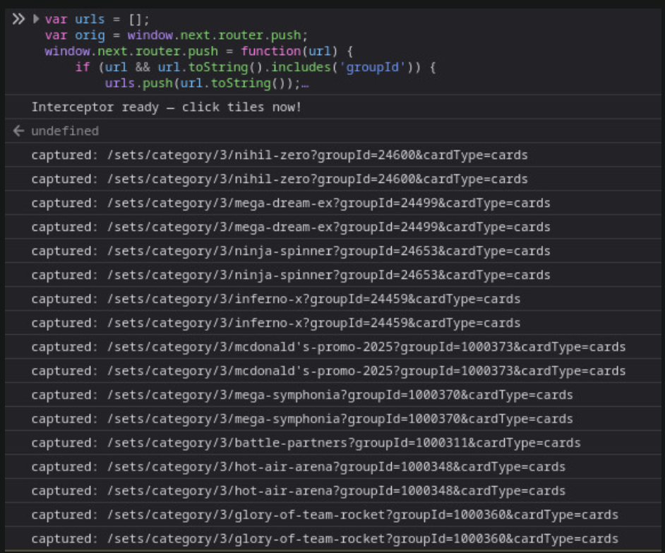

# Scraping Next.js React SPAs — Two Methods

A guide to extracting navigation URLs from modern React applications where tiles and cards use `onClick` handlers instead of `<a>` tags, making standard scraping tools ineffective.

---

## The Problem

Modern SPAs built with Next.js App Router present a unique scraping challenge:

- Tiles and cards are plain `<div>` or `<li>` elements with React `onClick` handlers — not `<a>` tags
- Data is fetched client-side via React Query after hydration — it is not in the initial HTML
- Key parameters (like IDs) live in React component state, invisible to the DOM
- Standard tools return empty results because the content they need doesn't exist at request time

---

## Why Standard Approaches Fail

| Method | Result | Reason |
|--------|--------|--------|
| `requests` / `httpx` | ❌ | Raw HTML has no rendered content |
| BeautifulSoup | ❌ | No `<a>` tags to parse |
| crawl4ai / Scrapy | ❌ | JS executes after scraper has already read the page |
| Playwright click | ⚠️ | Works but slow — navigation events may not fire |
| Next.js router patch | ✅ | Intercepts React navigation at the source |

---

## Method 1 — Patch the Next.js Router (Browser Console)

Next.js App Router uses `window.next.router.push()` for all client-side navigation. Replacing this function with a wrapper lets you capture every URL the app navigates to — including any query parameters stored in component state.

### How to use

1. Open the target page in your browser
2. Open DevTools → Console
3. Paste the interceptor:

```javascript
var urls = [];
var orig = window.next.router.push;
window.next.router.push = function() {
    var url = arguments[0];
    if (url) {
        urls.push(url.toString());
        console.log('[' + urls.length + ']', url);
    }
    return orig.apply(this, arguments);
};
console.log('Ready — interact with the page now.');
```

4. Click, scroll, or interact with the UI normally
5. Export captured URLs:

```javascript
copy(JSON.stringify(urls, null, 2));
console.log(urls.length + ' URLs captured');
```

### Output in console



### Why this works

The Next.js router is exposed on `window.next.router` and is a plain JavaScript object. Its `push` method is replaceable at runtime. Every navigation the app performs — regardless of how deeply it is triggered inside React components — passes through this single function.

---

## Method 2 — Playwright Automation

Uses a headless browser to load the page, scroll to trigger lazy loading, then click each element and record the resulting URL from `page.url`.

### Requirements

```bash
uv add playwright
uv run playwright install firefox
```

### Pattern

```python
import asyncio
import re
from playwright.async_api import async_playwright

async def scrape(start_url):
    collected = {}

    async with async_playwright() as p:
        browser = await p.firefox.launch(headless=False)
        page = await browser.new_page()

        await page.goto(start_url, wait_until="networkidle")

        # Scroll to trigger lazy loading
        for i in range(40):
            await page.evaluate(f"window.scrollTo(0, {i * 800})")
            await asyncio.sleep(0.4)
        await asyncio.sleep(1)

        # Get all tile positions
        tiles = await page.evaluate("""
        () => [...document.querySelectorAll('li.list-none')].map(t => {
            const rect = t.getBoundingClientRect();
            const p = t.querySelector('p');
            return {
                name: p ? p.innerText.split('\\n')[0].trim() : '',
                top: rect.top + window.scrollY,
                x: rect.left + rect.width / 2,
                y: rect.top + rect.height / 2
            };
        }).filter(t => t.name)
        """)

        for tile in tiles:
            await page.goto(start_url, wait_until="networkidle")
            await page.evaluate(f"window.scrollTo(0, {max(0, tile['top'] - 300)})")
            await asyncio.sleep(0.5)
            await page.mouse.click(tile['x'], tile['y'])
            await asyncio.sleep(1.5)

            url = page.url
            if url != start_url:
                collected[url] = tile['name']
                print(f"Captured: {tile['name']} → {url}")

        await browser.close()
    return collected
```

### Key insight

Instead of listening for navigation events (which may not fire with React router), compare `page.url` **before and after** each click. React router updates `window.location` synchronously — a short `asyncio.sleep` is enough to catch it.

---

## Core Concepts

**Why `page.url` works but navigation events don't**
React Router and Next.js App Router use the History API (`history.pushState`) directly. Playwright's `expect_navigation` listens for full page loads — not History API calls. Polling `page.url` after a click sidesteps this entirely.

**Why you need to return to the start URL each iteration**
After clicking a tile and recording its URL, `go_back()` may restore a cached React state that no longer has the full tile list rendered. Navigating back to the original URL guarantees a clean, fully rendered page each time.

**Why lazy loading matters**
Most SPAs virtualise long lists — only rendering tiles visible in the viewport. Scrolling the page before collecting tile positions ensures all elements exist in the DOM before you try to interact with them.

---

## Output Format

Both methods produce the same structure:

```json
[
  {
    "url": "https://example.com/sets/category/3/some-set?groupId=12345&cardType=cards",
    "name": "Some Set"
  }
]
```
